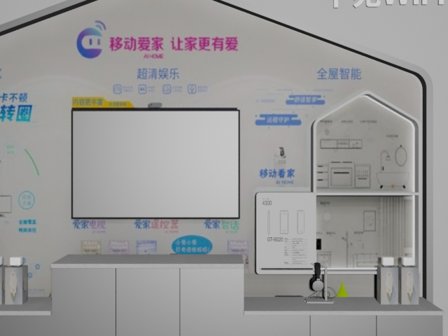

# BlenderCollector
## Description

This is a tool for generate data from Blender by import a 'fbx' model. It can generate four types, including RGB, depth, normals and semantic images. Simple to use, have a try.

## Results show

####  

## Env setup

python 3.11.11

```
$ conda env create -n BlenderCollector python=3.11
$ conda activate BlenderCollector
$ pip install -r requirements.txt
```

## QuickStart

    $ cd BlenderCollector
    $ blenderproc run blender_render.py

## TODO

- [x] Release the project code v1.0
- [ ] Add function: Add the point cloud and adaptive semantic image prediction


Thanks to [BlenderProc](https://github.com/DLR-RM/BlenderProc) for interface.
